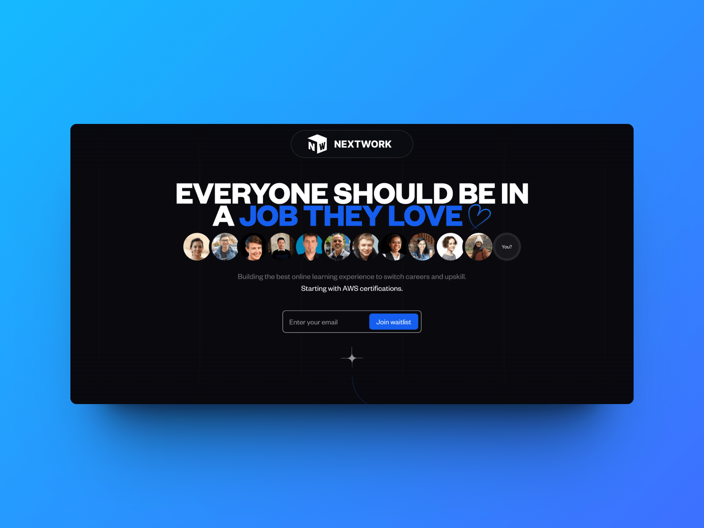
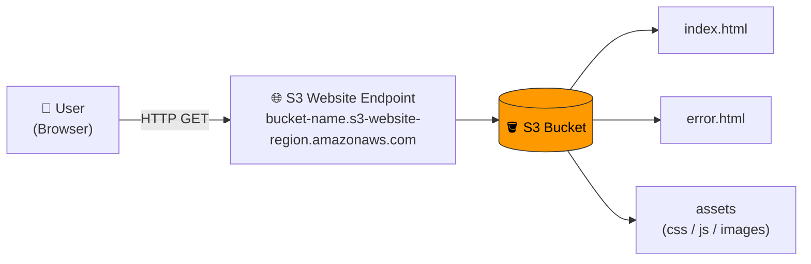
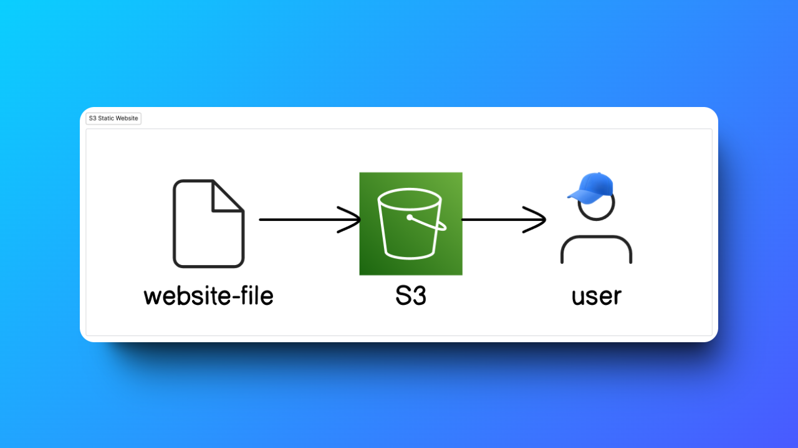

<div align="center">

# 🪣 AWS S3 Static Website Hosting

**A hands-on walkthrough for hosting a fully static website on Amazon S3 — no servers, no containers, just a bucket and a browser.**




</div>

---

## 📖 Table of Contents

- [What is this?](#-what-is-this)
- [Architecture](#-architecture)
- [Features](#-features)
- [Repo Structure](#-repo-structure)
- [Deployment Walkthrough](#-deployment-walkthrough)
- [Access Control with ACLs](#-access-control-with-acls)
- [Troubleshooting](#-troubleshooting)
- [Notes](#-notes)

---

## 🚀 What is this?

This project demonstrates how to host a **static website** using **Amazon S3** — turning a plain storage bucket into a publicly reachable web server. It's a compact reference for anyone learning core AWS concepts like bucket policies, ACLs, and static website hosting endpoints.

> 💡 No EC2, no Lambda, no backend. Just HTML/CSS/JS served straight out of an S3 bucket.

---

## 🏗️ Architecture


```mermaid
flowchart LR
    U["🧑 User\n(Browser)"] -->|HTTP GET| E["🌐 S3 Website Endpoint\nbucket-name.s3-website-region.amazonaws.com"]
    E --> B[("🪣 S3 Bucket")]
    B --> H["index.html"]
    B --> ERR["error.html"]
    B --> A["assets\n(css / js / images)"]

    style B fill:#FF9900,stroke:#333,stroke-width:1px,color:#000
```

<details>
<summary>📷 See the original architecture diagram</summary>

<br>



</details>

---

## ✨ Features

| Feature | Description |
|---|---|
| 🌍 **Static Website Hosting** | Publicly accessible via an S3-provided URL — no server management required |
| 🚫 **Custom Error Pages** | A dedicated error document improves the experience when something goes wrong |
| 🔐 **Access Management** | Bucket policies + ACLs control exactly who can read what |

---

## 🗂️ Repo Structure

```
AWS-S3-Static-Website/
├── Documentation/
│   └── Images/              # Screenshots used throughout this README
├── Website/
│   ├── index.html            # Entry point deployed to S3
│   └── Unzipped Folder/      # Site assets (HTML, CSS, JS, images)
└── README.md
```

---

## 🧭 Deployment Walkthrough

<details open>
<summary><b>Step 1 — Create an S3 Bucket</b></summary>

<br>

1. Log in to the [AWS Management Console](https://aws.amazon.com/).
2. Navigate to the **S3** service.
3. Create a new bucket:
   - Give it a globally unique name (e.g. `my-awesome-website-bucket`).
   - Choose a region closest to your target audience (e.g. Asia Pacific (Mumbai) `ap-south-1`).
4. Enable ACLs:
   - Under **Object Ownership**, select **ACLs enabled**.
   - This allows fine-grained control over the permissions of individual objects in the bucket.


</details>

<details>
<summary><b>Step 2 — Upload Your Files</b></summary>

<br>

1. Upload `index.html` and the unzipped assets folder to the S3 bucket.
2. Make sure the directory structure is preserved during upload — relative paths in the HTML depend on it.


</details>

<details>
<summary><b>Step 3 — Configure Static Website Hosting</b></summary>

<br>

1. Go to the bucket **Properties** tab.
2. Scroll to **Static website hosting** and choose **Enable**.
3. Set `index.html` as the **Index document**.
4. *(Optional)* Set a custom error document, e.g. `error.html`.


</details>

<details>
<summary><b>Step 4 — Access the Website</b></summary>

<br>

Use the bucket's public website endpoint:

```
http://your-bucket-name.s3-website-region.amazonaws.com
```

✅ That's it — your static site is now live on the internet.

</details>

---

## 🔑 Access Control with ACLs

**Access Control Lists (ACLs)** determine who can read or write objects in your bucket. This project uses them to make the site's files publicly readable.

- **Why ACLs?** They grant read/write permissions to specific AWS accounts — or the public — with more granularity than a single bucket policy.
- **How it's applied:**
  1. Select the uploaded files in the S3 console.
  2. From the **Actions** dropdown, choose **Make public using ACL**.
  3. This grants public read access, resolving `403 Forbidden` errors when hitting the website endpoint.

---

## 🛠️ Troubleshooting

| Symptom | Likely Cause | Fix |
|---|---|---|
| `403 Forbidden` | Objects aren't public | Select the files → **Actions** → **Make public using ACL** |
| Blank page / wrong file served | Index document not set | Re-check **Static website hosting** settings → Index document = `index.html` |
| Broken images/CSS | Directory structure not preserved on upload | Re-upload keeping the original folder hierarchy |

---

## 📝 Notes

> I deleted the resources from my AWS console after building this to avoid ongoing costs — this repository is the sole showcase of the work. Every step and screenshot above documents the actual process I followed, end to end.

---

<div align="center">

Built as a learning project for AWS S3 static website hosting 🪣

</div>
