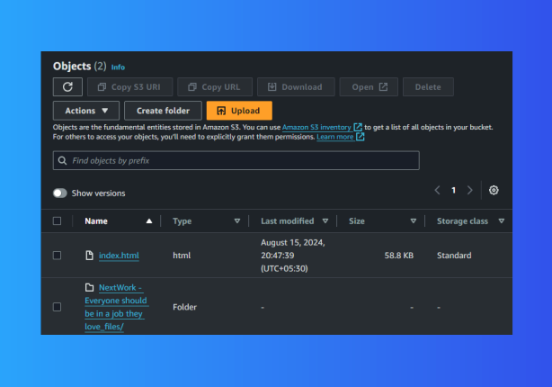

# AWS S3 Static Website Hosting Project

## Overview
This project demonstrates how to host a static website using Amazon S3. The website is a simple HTML page with associated assets, fully hosted on S3, showcasing how to leverage AWS for static content delivery.

## Features
- **Static Website Hosting**: Accessible via a public URL provided by S3.
- **Custom Error Pages**: Configured custom error pages for a better user experience.
- **Access Management**: Implemented AWS S3 Bucket Policies and ACLs to control public access.


## Setup and Deployment

### Step 1: Create an S3 Bucket
1. Log in to the [AWS Management Console](https://aws.amazon.com/).
2. Navigate to the `S3 service`.
3. Create a new bucket:
 * Give it a unique name (e.g., my-awesome-website-bucket).
 * Choose a region closest to your target audience (e.g., Asia Pacific (Mumbai) `ap-south-1`).
4. Enable ACLs:
   * During bucket creation, under "Object Ownership," select ACLs enabled.
   * This allows fine-grained control over the permissions of individual objects in the bucket.


### Step 2: Upload Files
1. Upload your website files:
  * Upload index.html and the unzipped folder to the S3 bucket.
  * Ensure the directory structure is preserved during the upload.




### Step 3: Configure the Bucket for Static Website Hosting
1. Go to the bucket properties in the S3 console.
2. Enable static website hosting:
   * In the "Static website hosting" section, choose Enable.
   * Set index.html as the Index document.
   * Optionally, set a custom error document like error.html.


### Step 4: Make the Website Public
1. Edit the bucket policy to allow public read access:
   ```json
   {
       "Version": "2012-10-17",
       "Statement": [
           {
               "Effect": "Allow",
               "Principal": "*",
               "Action": "s3:GetObject",
               "Resource": "arn:aws:s3:::your-bucket-name/*"
           }
       ]
   }
2. Apply the changes.

### Step 5: Access the Website
* Use the bucket's public URL to access the website. It typically looks like:
```
http://your-bucket-name.s3-website-region.amazonaws.com
```
### Challenges and Solutions
* **403 Forbidden Error:** Resolved by updating the bucket policy to allow public access.
* **Bucket Name Uniqueness:** S3 bucket names must be globally unique, which required choosing a distinctive name.

### Technologies Used

* **Amazon S3:** For storage and static website hosting.
* **HTML/CSS/JS:** For building the static website.
* **AWS Management Console:** For managing S3 settings and configurations.
